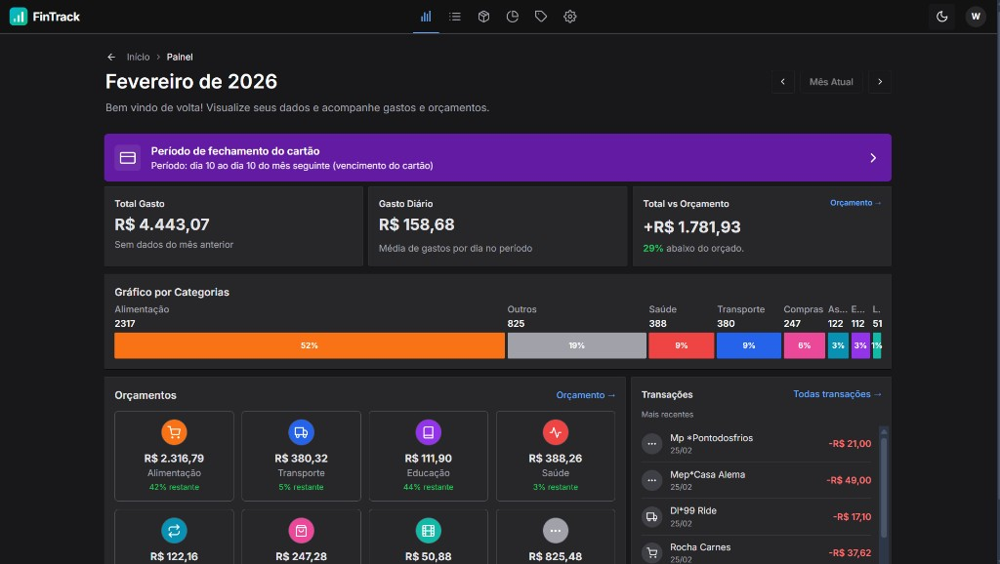
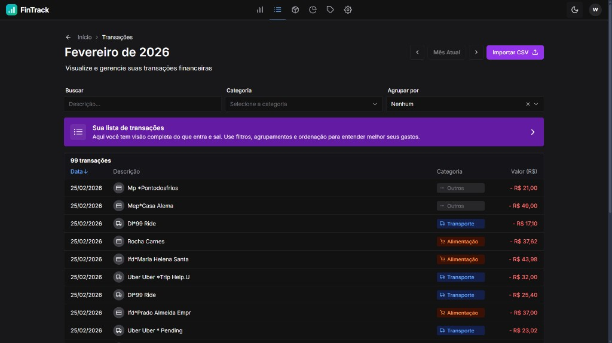
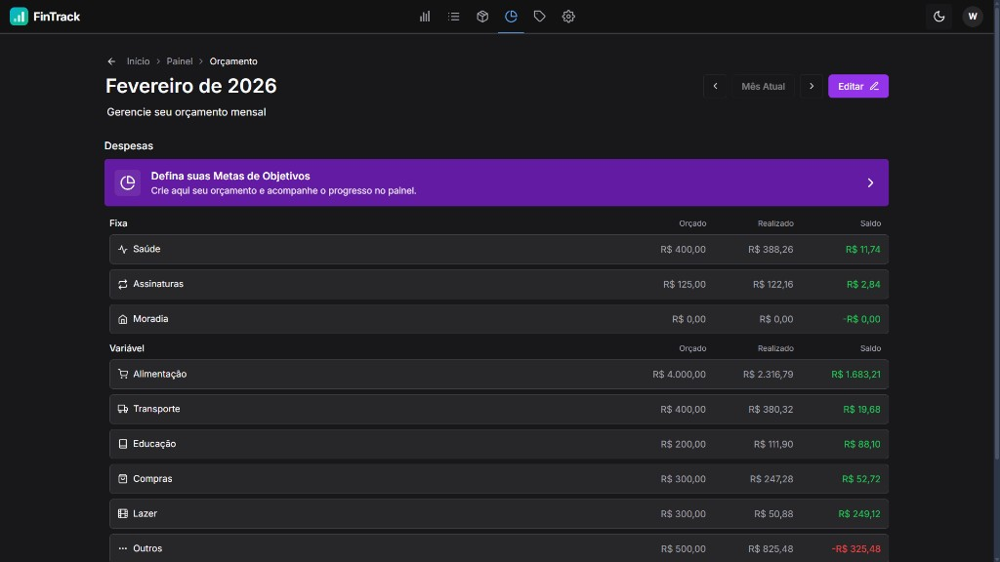

<div align="center">
  
  <h1>FinTrack</h1>
  <p><strong>Gestão inteligente de finanças pessoais</strong></p>
  <p>
    Controle despesas de cartão de crédito com importação CSV, leitura de cupons por IA e orçamentos inteligentes.
  </p>

  <p>
    <a href="#-começando">Começando</a> •
    <a href="#-funcionalidades">Funcionalidades</a> •
    <a href="#-segurança">Segurança</a> •
    <a href="#-deploy-no-netlify">Deploy</a> •
    <a href="#-contribuindo">Contribuindo</a>
  </p>
</div>

---

## 📋 Sobre

O **FinTrack** é um aplicativo web de finanças pessoais focado no controle de despesas de cartão de crédito. Construído como uma SPA (Single Page Application) com React e Firebase, funciona offline-first e pode ser implantado como PWA ou app nativo via Capacitor.

### Stack Tecnológica

| Camada | Tecnologia |
|--------|-----------|
| Frontend | React 19 · TypeScript · Vite 6 |
| Design System | Chakra UI v3 · Tailwind CSS |
| Estado | Zustand · TanStack Query |
| Backend (BaaS) | Firebase Auth · Firestore · Storage |
| IA / OCR | Google Gemini API |
| Deploy | Netlify (ou qualquer CDN estática) |

---

## ✨ Funcionalidades

- **🔐 Login com Google** — autenticação via Firebase Auth
- **📊 Painel analítico** — gráficos de despesas, comparativos mensais, resumo por categoria
- **💳 Gestão de transações** — criar, editar, excluir, filtrar e ordenar
- **📥 Importação CSV** — importe extratos de cartão de crédito com deduplicação automática
- **📸 OCR de cupons** — escaneie recibos/notas fiscais com IA (Google Gemini) para extrair transações e itens
- **💰 Orçamentos** — defina limites por categoria com recomendações baseadas em histórico
- **🏷️ Categorias e regras** — categorias personalizadas e classificação automática por palavras-chave
- **🏪 Registro de contrapartes** — memorize categorias por estabelecimento
- **🌙 Tema claro/escuro** — alternância de tema com suporte a preferência do sistema
- **📱 Responsivo** — funciona em desktop e mobile
- **⚡ Offline-first** — cache inteligente via TanStack Query

---

## 🖼️ Screenshots

<div align="center">

| Tela de Login | Painel (Dashboard) |
|:---:|:---:|
|  |  |

| Transações | Orçamentos |
|:---:|:---:|
|  |  |

</div>

> **Nota:** Screenshots serão adicionados conforme o projeto evolui. Para ver o app em ação, siga as instruções de [Começando](#-começando).

---

## 🚀 Começando

### Pré-requisitos

- **Node.js** ≥ 18 (recomendado: 22 LTS)
- **Yarn** ≥ 1.22
- Um projeto no **[Firebase Console](https://console.firebase.google.com/)** com:
  - Authentication (provedor Google habilitado)
  - Cloud Firestore
- _(Opcional)_ Chave da **[Google Gemini API](https://ai.google.dev/)** para OCR de cupons

### Instalação

```bash
# 1. Clone o repositório
git clone https://github.com/Neveskai/personal-assistant.git
cd personal-assistant

# 2. Instale as dependências
yarn install

# 3. Configure as variáveis de ambiente
cp .env.example .env
# Edite .env com as credenciais do seu projeto Firebase
```

### Variáveis de Ambiente

Crie um arquivo `.env` na raiz do projeto (use `.env.example` como referência):

```bash
# ── Firebase (obrigatórias) ──────────────────────────────────────────
VITE_FIREBASE_API_KEY=sua-api-key
VITE_FIREBASE_AUTH_DOMAIN=seu-projeto.firebaseapp.com
VITE_FIREBASE_PROJECT_ID=seu-projeto
VITE_FIREBASE_APP_ID=1:123456789:web:abc123

# ── Firebase (opcionais) ─────────────────────────────────────────────
VITE_FIREBASE_STORAGE_BUCKET=seu-projeto.appspot.com
VITE_FIREBASE_MESSAGING_SENDER_ID=123456789

# ── Gemini AI (opcional — habilita OCR de cupons) ────────────────────
# ⚠️  NÃO use prefixo VITE_ para esta chave! Ela é injetada via
#     vite.config.ts no build e nunca exposta diretamente no client.
GEMINI_API_KEY=sua-chave-gemini
```

> **⚠️ Importante:** Variáveis com prefixo `VITE_` são expostas no bundle do client. As credenciais Firebase _precisam_ desse prefixo (é o design do SDK), mas a proteção real vem das **Security Rules** (veja [Segurança](#-segurança)). Já a `GEMINI_API_KEY` **não deve** ter prefixo `VITE_` para não vazar no código do navegador.

### Executando

```bash
# Modo desenvolvimento (hot-reload)
yarn dev
# → http://localhost:3000

# Verificação de tipos (lint)
yarn lint

# Build de produção
yarn build

# Preview do build
yarn preview
```

---

## 🔒 Segurança

Este projeto foi preparado com camadas de segurança para open-source e deploy público.

### 1. Firebase Security Rules

Regras para Firestore e Storage estão nos arquivos `firestore.rules` e `storage.rules`. Para implantar:

```bash
# Instale o Firebase CLI (se ainda não tiver)
npm i -g firebase-tools

# Faça login (se der "spawn cmd ENOENT" no Windows, use: firebase login --no-localhost)
firebase login
firebase use <seu-project-id>   # mesmo valor de VITE_FIREBASE_PROJECT_ID no .env

# Implante as regras (firebase.json já referencia firestore.rules e storage.rules)
firebase deploy --only firestore:rules,storage:rules
```

**Se o login falhar** com `Error: spawn cmd ENOENT` (comum no terminal do Cursor/nvm no Windows), use `firebase login --no-localhost`: o CLI exibe uma URL, você abre no navegador, faz login, copia o código e cola no terminal.

**Regras incluídas:**
- Somente usuários autenticados acessam dados
- Documentos de configuração (`users`), transações e contrapartes isolados por `userId`
- Cláusula catch-all que nega todo acesso não previsto
- Limites de tamanho de documento

> **Migração:** Se você já tem dados no Firestore criados antes do isolamento por `userId`, é necessário rodar uma migração única para preencher o campo `userId` em todos os documentos de `transactions` e `counterparties`. Veja [Revisão de segurança](docs/SECURITY-REVIEW.md) para detalhes.

### 2. Proteção de API Keys

| Chave | Visível no client? | Proteção |
|-------|:---:|----------|
| Firebase Config (`VITE_*`) | ✅ Sim | Protegida por Security Rules + restrição de domínio no Google Cloud Console |
| Gemini API Key (`GEMINI_API_KEY`) | ⚠️ No bundle | Injetada em build-time via `vite.config.ts`; restringir a chave no Google Cloud (referrer/API) e considerar backend para OCR em produção |

**Como aplicar essas configurações (produção):**

- **Restringir a API Key do Firebase**
  1. Abra [Google Cloud Console → Credentials](https://console.cloud.google.com/apis/credentials) e selecione o projeto do Firebase (mesmo `VITE_FIREBASE_PROJECT_ID`).
  2. Na lista **API Keys**, clique na chave usada pelo app (a que está em `VITE_FIREBASE_API_KEY`). Se não souber qual é, compare o valor no `.env` com o prefixo exibido na tabela.
  3. Em **Application restrictions** → **HTTP referrers**, adicione apenas os domínios permitidos, por exemplo:
     - `https://seudominio.com/*`
     - `https://*.netlify.app/*` (para deploys de preview)
     - `http://localhost:*` (só para desenvolvimento).
  4. Em **API restrictions** → **Restrict key**, marque apenas: **Firebase Authentication API**, **Cloud Firestore API**, **Cloud Storage** (se usar), etc. Evite "Don't restrict key".
  5. Salve.

- **Ativar Firebase App Check**
  1. No [Firebase Console](https://console.firebase.google.com/), selecione o projeto.
  2. Menu lateral: **Build** → **App Check**.
  3. Clique em **Get started** (ou **Registrar**).
  4. Para web: registre o app (tipo Web) e escolha um provedor — por exemplo **reCAPTCHA v3** (crie um site key em [Google reCAPTCHA Admin](https://www.google.com/recaptcha/admin) e use no registro). Depois ative **Enforce** para Firestore e Storage para que requisições sem token válido sejam bloqueadas.
  5. No código do app será preciso integrar o SDK do App Check e inicializar com a chave do reCAPTCHA; depois disso o Console passa a aceitar tráfego do seu domínio.

- **Alertas de billing (Firestore / uso geral)**
  1. [Google Cloud Console](https://console.cloud.google.com/) → selecione o projeto.
  2. Menu **Billing** → **Budgets & alerts** (ou [Billing → Budgets](https://console.cloud.google.com/billing/budgets)).
  3. **Create budget**: defina um limite (ex.: valor do plano Blaze ou um teto em R$) e adicione alertas por e-mail em 50%, 90%, 100%.

### 3. Rate Limiting

- **OCR (Gemini):** máximo 10 requisições por minuto por sessão (client-side, `src/common/utils/rate-limiter.ts`)
- **Firebase:** o Firestore tem quotas nativas (50.000 reads/dia no plano Spark gratuito). Configure alertas de billing no Console.

### 4. Headers de Segurança (Netlify)

O `netlify.toml` configura automaticamente:
- `Content-Security-Policy` — restringe origens de scripts, estilos e conexões
- `X-Frame-Options: DENY` — impede embedding em iframes
- `Strict-Transport-Security` — força HTTPS
- `X-Content-Type-Options: nosniff` — previne MIME sniffing
- `Referrer-Policy` — limita envio de referrer
- `Permissions-Policy` — desabilita câmera, microfone e geolocalização

### 5. Checklist de Segurança para Deploy

- [ ] Configurar Firebase Security Rules (`firebase deploy --only firestore:rules`)
- [ ] Restringir API Key no Google Cloud Console (domínios + APIs)
- [ ] Ativar Firebase App Check
- [ ] Configurar alertas de billing no Firebase Console
- [ ] Garantir que `GEMINI_API_KEY` **não** tem prefixo `VITE_`
- [ ] Revisar regras de Storage antes de habilitar uploads

---

## 🌐 Deploy no Netlify

### Deploy Automático

1. Conecte o repositório no [Netlify](https://app.netlify.com/)
2. O `netlify.toml` já configura build e redirects automaticamente
3. Adicione as variáveis de ambiente na aba **Site settings → Environment variables:**

   ```
   VITE_FIREBASE_API_KEY       = ...
   VITE_FIREBASE_AUTH_DOMAIN   = ...
   VITE_FIREBASE_PROJECT_ID    = ...
   VITE_FIREBASE_APP_ID        = ...
   GEMINI_API_KEY              = ...   (opcional)
   ```

4. Deploy! 🚀

### Deploy Manual

```bash
# Build local
yarn build

# Instale o Netlify CLI
npm i -g netlify-cli

# Deploy
netlify deploy --prod --dir=dist
```

### Limites do Plano Gratuito (Netlify)

| Recurso | Limite |
|---------|--------|
| Bandwidth | 100 GB/mês |
| Build minutes | 300 min/mês |
| Sites | ilimitados |

Para custos do Firebase (plano Spark gratuito): [Firebase Pricing](https://firebase.google.com/pricing)

---

## 🏗️ Arquitetura

```
src/
├── app.tsx                    # Ponto de entrada + providers
├── routes.tsx                 # Router principal (auth guard)
├── common/
│   ├── hooks/                 # Hooks compartilhados
│   ├── services/
│   │   ├── Firebase/          # Inicialização do Firebase
│   │   ├── OCR/               # Serviço de OCR via Gemini
│   │   └── UserSettings/      # Configurações do usuário
│   ├── stores/                # Zustand store (auth)
│   ├── ui/                    # Design system (Chakra UI wrappers)
│   └── utils/                 # Utilitários (rate limiter, env validation)
├── Login/                     # Tela de login
└── Transactions/
    ├── common/
    │   ├── enums/             # Enums (Source, TransactionType, Category)
    │   ├── hooks/             # Hooks de transações
    │   ├── services/          # Serviços (CRUD Firestore)
    │   └── ui/                # Componentes de UI
    ├── domain/                # Entidades e helpers de domínio
    ├── pages/                 # Páginas da aplicação
    │   ├── Panel/             # Dashboard analítico
    │   ├── List/              # Lista de transações
    │   ├── ItemsList/         # Lista de itens
    │   ├── Import/            # Importação CSV
    │   ├── Budget/            # Orçamentos
    │   ├── Settings/          # Configurações
    │   └── ClassificationCategories/  # Regras de classificação
    └── stores/                # Zustand stores (filtros, formulários)
```

### Rotas

| Rota | Página |
|------|--------|
| `/finances/` | Painel (Dashboard) |
| `/finances/transactions` | Lista de transações |
| `/finances/items` | Lista de itens |
| `/finances/import` | Importação CSV |
| `/finances/budget` | Orçamentos |
| `/finances/classification` | Classificação e categorias |
| `/finances/settings` | Configurações |

---

## 🤝 Contribuindo

Contribuições são bem-vindas! Veja o [CONTRIBUTING.md](CONTRIBUTING.md) para mais detalhes.

---

## 📄 Licença

Este projeto está licenciado sob a [MIT License](LICENSE).

---

<div align="center">
  <sub>Feito com ❤️ para a comunidade open-source brasileira</sub>
</div>
